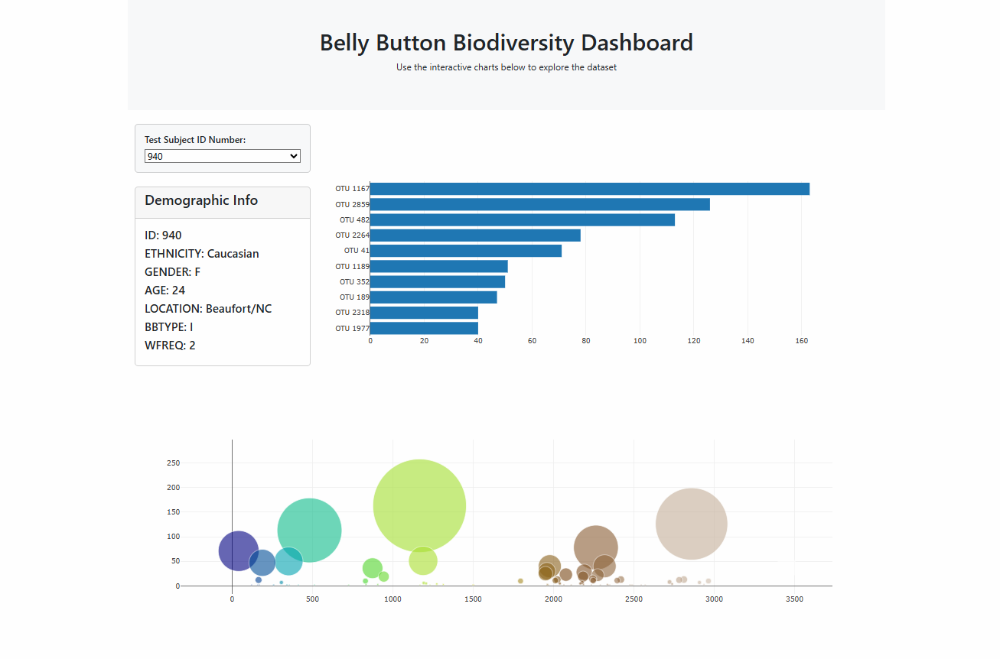

# Belly-Button Challenge

## Website: 
[website](https://rock-roll1968.github.io/Belly-Button-Challenge/)

## Description
Statistical Analysis of Human Navel Bacterial Cultures 

## Table of Contents
- [Installation](#installation)
- [Usage](#usage)
- [Credits](#credits)
- [License](#license)
- [Features](#features)

- [Contact](#contact)

## Installation
VS Code, Plotly, D3 JS, HTML, JSON

## Usage
Run HTML / JS code file

## Credits
Ernesto V Garcia

## License
MIT

## Features
Interactive Chart with Drop Down for Bar and Bubble graphs 

## Contact
If there are any questions or concerns, I can be reached at:
##### [github: ROCK-ROLL1968](https://github.com/ROCK-ROLL1968)
##### [email: ernesto.v.garcia@outlook.com](mailto:ernesto.v.garcia@outlook.com)
